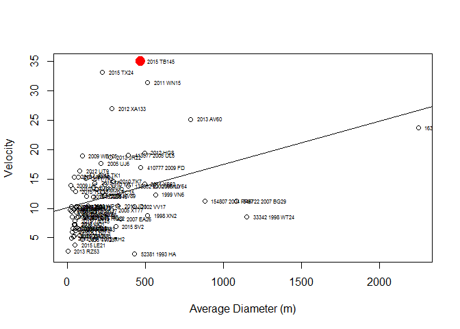
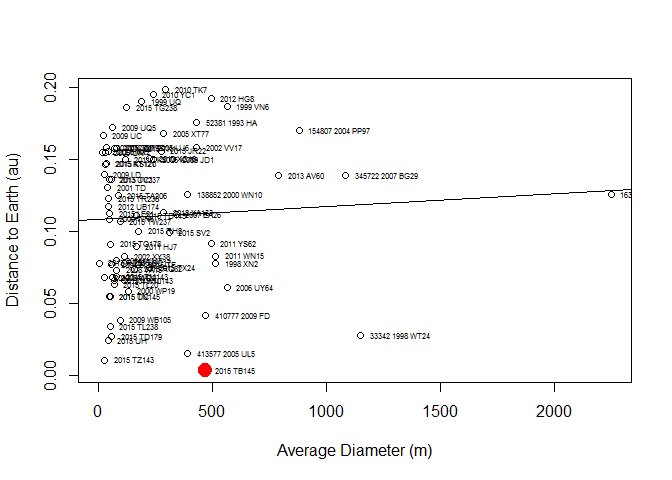
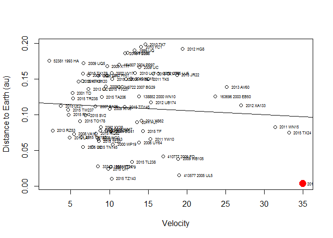

# Analysis of the Near Earth Object Asteroid Dataset

#### Kory Becker - October 21, 2015

## Synopsis

This document is a basic analysis of the NASA [Near Earth Object](http://neo.jpl.nasa.gov/ca/) (NEO) database, with specific highlight of the October 31, 2015 asteroid, 2015 TB145.

The NEO database contains a list of asteroids and comets that have been determined to have a perihelion distance of less than 1.3 AU. Comets are further restricted to those within an orbital period of less than 200 years.

The analysis shows that the 2015 TB145 asteroid is a particular outlier in the current dataset, specifically with regard to velocity, size, and distance to Earth.

## Data Processing

The data source comes from the table of near Earth objects on the NASA JPL NEO Close Approach [web site](http://neo.jpl.nasa.gov/ca/). The table of data was extracted and saved to a tab-separated [file](https://raw.githubusercontent.com/primaryobjects/asteroids/master/asteroids.tsv), which can be processsed as shown below. Full source code for this analysis is available [online](https://github.com/primaryobjects/asteroids).


```r
library(stringr)

# Read data.
data <- read.csv('asteroids.tsv', sep='\t', stringsAsFactors = FALSE)

# Set column names.
names(data) <- c('name', 'date', 'au', 'ld', 'diameter', 'h', 'velocity')

# Cleanup name, remove parenthesis.
data$name <- gsub('[\\(\\)]', '', data$name)

# Calculate average size, based on low and high range on diameter.
data$size <- sapply(data$diameter, function(d) {
  match <- str_match(d, '([-+]?[0-9]*\\.?[0-9]+) (k?m)( - ([-+]?[0-9]*\\.?[0-9]+) (k?m))?')

  # Extract low value.
  low <- as.numeric(match[2])
  if (match[3] == 'km') {
    # Convert to meters.
    low <- low * 1000
  }
  
  # Extract high value, if available.
  high <- low
  if (!is.na(match[5])) {
    high <- as.numeric(match[5])
    
    if (match[6] == 'km') {
      # Convert to meters.
      high <- high * 1000
    }
  }
  
  # Use average of low and high.
  mean(c(low, high))
})
```

Since the diameter of objects in the table coorespond to a range of values, we take the mean value of the low and high range to calculate an average size.

## Size vs Velocity

We can visualize the data with regard to diameter and velocity by plotting the objects. The immediate outliers in the data become apparent in the resulting graph. Two objects, in particular, represent the most extreme ends of the graph, They include [2015 TB145](http://ssd.jpl.nasa.gov/sbdb.cgi?sstr=2015%20TB145;orb=1) and [163696 (2003 EB50)](http://ssd.jpl.nasa.gov/sbdb.cgi?sstr=163696;orb=1).

2015 TB145 has the highest velocity in the dataset, at 34.95 km/s. 163696 (2003 EB50) has the largest size at a mean of 2,250m in diameter.

 

*Figure 1a. Visualizing the near Earth object database as velocity by diameter. The asteroid 2015 TB145 represents the fastest moving object in the dataset at 34.95 kb/s.*


```
##                name         date     au        diameter velocity
## 31       2015 TB145  2015-Oct-31 0.0033   290 m - 650 m    34.95
## 21        2015 TX24  2015-Oct-29 0.0750   140 m - 310 m    33.16
## 71        2011 WN15  2015-Dec-05 0.0829   320 m - 710 m    31.37
## 60       2012 XA133  2015-Nov-27 0.1134   180 m - 390 m    26.99
## 79        2013 AV60  2015-Dec-16 0.1387  480 m - 1.1 km    25.14
## 63 163696 2003 EB50  2015-Nov-29 0.1254 1.4 km - 3.1 km    23.68
```

## Distance to Earth by Size

We can visualize one of the most critical points with respect to Earth, by displaying the distance of each object by its cooresponding size. The asteroid 2015 TB145 is the closest approaching object in the dataset. The asteroid will pass by Earth at an estimated distance of 0.0033 AU or 1.3 lunar distance.

In addition to its estimated approach proximity to Earth, 2015 TB145 is classified by NASA JPL with a [condition code](http://ssd.jpl.nasa.gov/sbdb_help.cgi?name=condition_code) 8. Condition code is defined as, "orbit uncertainty estimate 0-9, with 0 being good, and 9 being highly uncertain".

 

*Figure 2a. The asteroid 2015 TB145, highlighted in red, represents the closest approaching object to Earth included in the dataset.*


```
##               name         date     au       diameter velocity
## 31      2015 TB145  2015-Oct-31 0.0033  290 m - 650 m    34.95
## 6       2015 TZ143  2015-Oct-22 0.0108    16 m - 36 m    10.26
## 52 413577 2005 UL5  2015-Nov-20 0.0153  240 m - 540 m    18.99
## 25         2015 UH  2015-Oct-29 0.0243    26 m - 58 m     9.87
## 37      2015 TD179  2015-Nov-04 0.0272    35 m - 78 m    10.16
## 78 33342 1998 WT24  2015-Dec-11 0.0280 700 m - 1.6 km     8.51
```


## Distance to Earth by Velocity

The velocity of 2015 TB145 also displays as an outlier, with regard to the dataset. The asteroid has a velocity of 34.95 km/s and is the fastest moving near Earth object within the dataset.

 

*Figure 3. The asteroid 2015 TB145, highlighted in red, represents the fastest moving and closest approaching object within the dataset.*

## Conclusion

Through the analysis of the NASA JPL Near Earth Object database, we've determined that currently, the object with the highest velocity is the 2015 TB145 asteroid, due for fly-by on October, 31 2015. This asteroid is also the largest closest passing object currently in the active dataset. A second outlier object is 163696 (2003 EB50), holding the largest diameter of all objects in the dataset, due for fly-by on November 29, 2015. Of important note is the condition code 8 classification for 2015 TB145, indicating the asteroid's orbit is highly uncertain. This may be a result of the recent discovery of its presence, combined with the high velocity of movement.

## Sources

1. NASA, Near Earth Object Program *[[link]](http://neo.jpl.nasa.gov/index.html)*

2. NASA, Near Earth Object Program, Close Approaches *[[link]](http://neo.jpl.nasa.gov/ca/)*

3. JPL Small-Body Database Browser, 2015 TB145 Orbit Determination Parameters *[[link]](http://ssd.jpl.nasa.gov/sbdb.cgi?sstr=2015%20TB145;orb=1)*
